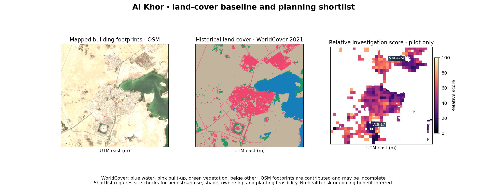
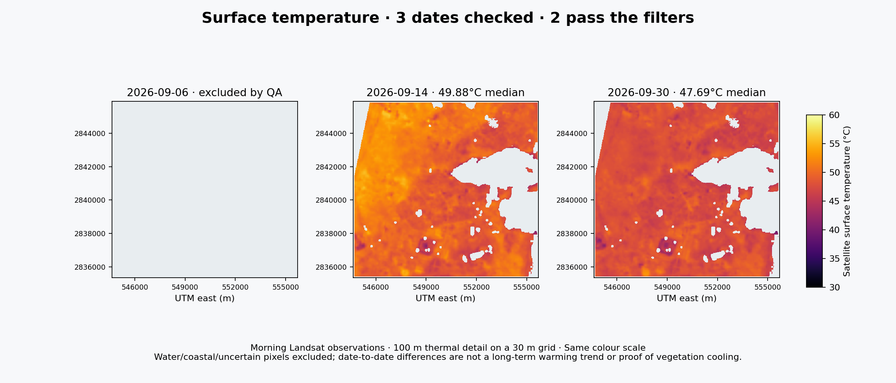

# UrbanHeat AI: Al Khor area study

Team **Al Zubarah (الزبارة)**, Qatar. Theme: **Urban Expansion, Land Use Change & Heat Risk**.

This open-data PoC combines satellite surface temperature, green-pixel share, contributed building footprints and historical land cover to shortlist places for site investigation across the Al Khor area. It expands the earlier Pearl pilot, retained on `backup/pearl-2026-10-05`.

**Status:** review draft. Clean command-line regeneration and numerical checks passed on 5 October 2026. All five unchanged notebook cells also passed an in-process IPython check with zero errors and all 35 input hashes verified. Normal Jupyter execution of this Al Khor version on a separate machine is pending. The previous Pearl notebook pass does not validate this new version. Team roles, member registration, evaluator access and final approval remain outstanding. Nothing has been submitted.

## 1. Intended user and use case

An urban planner can use the map to arrange site visits before proposing shade or planting improvements. Each candidate shows the contributing indicators, observed coverage and rank sensitivity. Visits must establish pedestrian activity, shade, ownership and feasibility. No user interview, measured time saving or cooling benefit is claimed.

## 2. Problem and study scope

The analyst-defined WGS84 window is **51.445–51.555°E, 25.635–25.730°N**, around Al Khor, its northern urban edge, Al Bayt Stadium and surrounding desert/coastal context. It is a broad city-area study window, approximately 116 km², **not an official administrative boundary or the whole municipality**. It does not imply complete observation of every property. Review the boundary on the satellite image before interpreting coverage.

The submitted idea proposed VHR pretrained AI segmentation of buildings, paving, vegetation and open land. This first-stage implementation uses open imagery, contributed building geometry and an upstream ML-derived land-cover product. It does not run our own AI segmentation, separate paved surfaces, map current shade, estimate health risk or measure urban expansion. Suitable VHR data and those indicators remain extensions.

## 3. Data and provenance

| Source | Dates/version | Use | Terms |
|---|---|---|---|
| Sentinel-2 L2A, Element 84 Earth Search | 5, 15, 30 Sep 2026 | BOA reflectance; 10 m visible/NIR; 20 m SWIR and SCL | Copernicus Sentinel terms |
| Landsat 8/9 Collection 2 L2, Planetary Computer | 6, 14, 30 Sep 2026 | ST_B10, QA_PIXEL, QA_RADSAT, ST_QA, cloud distance | USGS unrestricted use, attribution |
| ESA WorldCover 2021 v200 | Historical 2021 | CatBoost-derived 10 m land-cover context and conservative screening | CC BY 4.0 |
| OpenStreetMap official API | Downloaded 5 Oct 2026; edit dates vary | Closed building, water, grass ways and coastline references | ODbL 1.0 |

`scene.json`, `landsat-scene.json`, `metadata/` and `analysis-config.json` record exact source IDs, unsigned URLs, scaling, tiled OSM queries and study parameters. All 35 packaged input files have SHA256 hashes. The OSM excerpt removes contributor identifiers, contact tags and unrelated features. Mapping is incomplete and some water tags conflict with visible land. No VHR, 813 or hyperspectral data are used.

## 4. Processing and screening

1. Align optical crops on a 10 m UTM 39N grid. Respect Earth Search's applied BOA offset flag. Use nearest-neighbour SCL and bilinear SWIR resampling. Compute NDVI and MNDWI.
2. Require SCL 4/5 land on all three optical dates. Flag water using SCL, Landsat QA and an uncalibrated MNDWI >0.20 / NDVI <0.10 rule. Conservatively also exclude historical WorldCover water, herbaceous wetland and mangrove classes. These historical classes are exclusions, not current truth.
3. Buffer those exclusions by 60 m and remove a 60 m crop-edge halo. Require ≥90% inland optical support per delivered thermal pixel.
4. Convert ST_B10 using `DN × 0.00341802 + 149 − 273.15`. Exclude QA bits 0–5 and water bit 7, radiometric flags, missing values, ST_QA >2 K and cloud distance <1 km. Native thermal detail is about 100 m on a delivered 30 m grid.
5. Qualify a date only if ≥50% of historical urban inland support passes strict QA. The cutoff was defined before inspecting Al Khor temperatures. Historical support means ≥10% WorldCover built-up optical pixels per thermal footprint; it is an incomplete current-city proxy. At least two dates must qualify. September 6 covers 0%; September 14 and 30 cover about 99% each. Compare their intersecting support.
6. Rasterise closed OSM ways and WorldCover. Multipolygon relations, small center-sampled buildings and unmapped development may be missed. WorldCover class 50 includes buildings, roads and structures.
7. Report 300 m cells with ≥25 common delivered 30 m samples. Temperature and product uncertainty are medians; green-pixel share is the fraction of matched clear-land pixels with NDVI ≥0.30. Report observed cell coverage. It is not subpixel fractional vegetation or a tree/shade inventory.
8. Screen urban candidates using historical built-up share ≥10% OR mapped-building share ≥2% within retained land support. Keep all observed context cells available for inspection, but assign no rank to excluded context. This uncalibrated rule can miss new or unmapped urban areas.
9. Score only the candidate pool: `100 × (0.50 heat percentile + 0.30 inverse green-pixel percentile + 0.20 mapped-building percentile)`, with tie-aware midranks. WorldCover affects eligibility but does not directly enter the score. This is a relative investigation heuristic, not heat-health risk.
10. Test 13 settings: NDVI 0.2/0.3/0.4, buffers 30/60/100 m, ST_QA 2/2.5/3 K, minimum samples 25/50, alternative score weights and looser/tighter urban cutoffs (5%/1%, 20%/5%). Urban-cutoff scenarios change the candidate pool; other settings use the baseline pool. The separate coastal sensitivity table requires all three thermal dates, unlike the primary comparison.

The deterministic workflow uses reference-sampling seed `20261004`. No model training, GPU, API key or live API is needed for the packaged analysis.

## 5. Installation

Requires Python 3.12. From the repository root:

```sh
python -m venv .venv
# Linux/macOS
source .venv/bin/activate
# Windows PowerShell: .venv\Scripts\Activate.ps1
python -m pip install -r requirements.txt
```

Direct dependencies are pinned; `requirements-lock.txt` records the tested environment.

## 6. Run and reproduce

```sh
jupyter lab pilot.ipynb
```

Restart the kernel and run all cells. The notebook regenerates result tables, figures and map assets from the included inputs. Command-line equivalent:

```sh
python src/export_map.py
python src/verify.py
```

For the portable interactive map, after generating assets:

```sh
python -m http.server 8000 --directory app
```

Open `http://localhost:8000`. The map keeps temperature, green signal, mapped buildings, investigation score and temperature uncertainty separate. It supports all observed cells, with urban candidates distinguished from context.

Optional `src/fetch_sample.py` retrieves missing source crops. `src/fetch_osm.py` retrieves a new live snapshot; this changes inputs and must not be presented as exact reproduction. Preserve the packaged OSM data. `src/check_notebook.py` verifies hashes and executes an ordinary notebook kernel; its report must be read before claiming that check passed. GitHub Actions removes generated outputs before executing.

## 7. Example inputs and outputs

Example inputs: `data/sample_input/red.tif`, `landsat/lwir11.tif`, `reference/worldcover2021.tif`, `reference/osm-map.osm`.





`context-cells.csv` contains all observed cells. `planning-cells.csv` and `.geojson` contain the urban shortlist, coverage, scores and sensitivity. `reference-samples.csv` records source labels, rule agreement, retained thermal support and pending human confirmation. `app/` contains the portable interface; its numerical assets regenerate from the notebook. The owner-private hosted map supplements an evaluator-accessible repository.

## 8. Results and validation limits

The primary comparison retains **94.4379 km²** of matching inland sample footprints across the broad window. It reports **1111 observed cells**, including **373 screened urban candidates** with **31.8195 km²** of retained sample footprint. These are sample footprints, not a measurement of total city built-up area. Delivered thermal pixels are spatially dependent.

| Candidate | Mean cell surface °C* | Green %* | Mapped buildings % | Rank range |
|---|---:|---:|---:|---:|
| V04-23 | 50.4 | 0.0 | 2.3 | 1–14 |
| V28-17 | 50.0 | 0.0 | 0.1 | 1–23 |
| V04-24 | 50.2 | 0.1 | 2.9 | 2–34 |

*Means of date-level cell summaries. Rank ranges describe selected settings, not confidence intervals. The leading candidates change order under alternative weights and thresholds; there is no uniquely certified priority site.

Reference checks use contributed labels, 100 m spacing where feasible and a 10 m interior erosion. Of 30 coastal reference points, 20 agree with the spectral/QA water flag; **none enter retained thermal support** after conservative exclusions. Shoreline vegetation and tides complicate those labels. All 30 sampled OSM-water polygon points disagree with the rule; imagery review shows that some contributed water geometry spans dry/urban land. These conflicts are documented rather than treated as reliable truth or used to force a water mask. Of 25 grass reference points, 24 pass the green threshold; none of 30 building references do. Historical built-up class agrees at 25/30 building points. Human confirmations are pending. Positive-only checks are not overall accuracy estimates; WorldCover uses some OSM auxiliary inputs.

Numerical checks verify temperature conversion, QA exclusions, support counts, grid alignment, urban eligibility and map consistency. All five notebook cells passed an in-process IPython check in this workspace. All seven regenerated CSV tables exactly match the uploaded baseline. Separate ordinary Jupyter execution remains pending because workspace socket permissions blocked normal kernel startup. See `results/notebook-verification-inprocess.json` and `docs/Verification-Report.md`. Reproducibility does not establish scientific accuracy.

ST_QA is product-reported per-pixel uncertainty, not a confidence interval for a cell median or all systematic error. ASTER emissivity history, vegetation-adjustment issues, small-target blockiness, water mixing, missing mapping and threshold choices can affect results. No field thermal calibration, air temperature, population exposure, shade validation, rural-reference UHI, long-term change, causal cooling or health outcomes are established. Two accepted morning dates cannot establish these claims.

## 9. Team members and roles

- Nasser Alhuri — registered team leader.
- Abdulrahman Almohannadi
- Mohammed Almarri
- Majed Alkuwari
- Ali Alkubaisi

Roles beyond team leadership and actual contributions remain unassigned/unconfirmed. The guide requires members and roles. No role or completed contribution is invented. Code and writing were developed with AI assistance and require team review and ownership.

## 10. Licences and sources

Original code: MIT. Upstream data retain their terms; filtered/derived OSM geometry remains ODbL. See `LICENSE` and `DATA-LICENSES.md`.

- [USGS surface-temperature processing](https://www.usgs.gov/landsat-missions/landsat-collection-2-surface-temperature)
- [USGS known issues](https://www.usgs.gov/landsat-missions/landsat-collection-2-known-issues)
- [NASA Landsat 9](https://science.nasa.gov/mission/landsat-9/)
- [Earth Search processing](https://github.com/Element84/earth-search/blob/main/README.md)
- [ESA WorldCover dataset](https://doi.org/10.5281/zenodo.7254220)
- [WorldCover product manual](https://esa-worldcover.s3.eu-central-1.amazonaws.com/v200/2021/docs/WorldCover_PUM_V2.0.pdf)
- [OSM licence](https://www.openstreetmap.org/copyright)
- [OSM coastline convention](https://wiki.openstreetmap.org/wiki/Tag:natural%3Dcoastline)

Contains modified Copernicus Sentinel data (2026). Landsat imagery courtesy of USGS; doi.org/10.5066/P9OGBGM6. ESA WorldCover 2021 v200, Zanaga et al. (2022), CC BY 4.0, doi.org/10.5281/zenodo.7254220. © OpenStreetMap contributors, ODbL.
